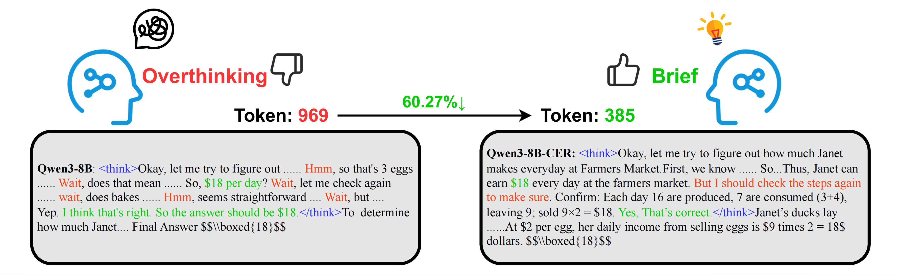

# 🚀 Explore Briefly, Then Decide: Mitigating LLM Overthinking via Cumulative Entropy Regulation
-----------------

[📄 Paper](https://arxiv.org/abs/2510.02249) | [🤖 Model](#model) | [📊 Dataset](#dataset)

## 🌟 Introduction

Welcome to the official repository for **Explore Briefly, Then Decide: Mitigating LLM Overthinking via Cumulative Entropy Regulation**.

Our work investigates *overthinking* in Large Language Models (LLMs) from an **entropy perspective**.  
We define the **T**oken **E**ntropy **C**umulative **A**verage (**TECA**) as the moving cumulative average of token entropy.  
Based on this, we propose a new reasoning paradigm: **"Explore Briefly, Then Decide"**.  

We argue that overthinking often arises from uncertainty during exploration. Instead, models should explore briefly and then commit to an answer. By incorporating the final TECA value into reinforcement learning rewards, we train models that effectively reduce overthinking. Detailed analysis and results can be found in our paper.  



We open-source our **models**, **datasets**, and **code** here for the community. 🎉

---

## ⚙️ Environment

We mainly used the **VERL training framework**. Please follow the [official installation guide](https://verl.readthedocs.io/en/latest/start/install.html). A simplified setup is shown below:

```bash
conda create --name CER python=3.10
conda activate CER

# only supports running with FSDP
USE_MEGATRON=0 bash scripts/install_vllm_sglang_mcore.sh

# install verl
cd verl
pip install --no-deps -e .
```

---

## 🧩 Models

<a name="model"></a> 

We trained **Qwen3-4B** and **Qwen3-8B** models on the **GSM8K training set**. Open-source checkpoints are available on Hugging Face and ModelScope:

|  Model Name  | Base LLM |                 HF Link                  |             Modelscope Link              |
| :----------: | :------: | :--------------------------------------: | :--------------------------------------: |
| Qwen3-4B-CER | Qwen3-4B | [link](https://huggingface.co/Ausert/Qwen3-4B-CER) | [link](https://www.modelscope.cn/models/ausertdream/Qwen3-4B-CER) |
| Qwen3-8B-CER | Qwen3-8B | [link](https://huggingface.co/Ausert/Qwen3-8B-CER) | [link](https://www.modelscope.cn/models/ausertdream/Qwen3-8B-CER) |

---

## 📚 Dataset

<a name="dataset"></a>

We used the **GSM8K training set** for model training and other datasets for evaluation.

| Dataset |                 HF Link                  |             Modelscope Link              |
| :-----: | :--------------------------------------: | :--------------------------------------: |
|  GSM8K  | [link](https://huggingface.co/datasets/openai/gsm8k) | [link](https://www.modelscope.cn/datasets/modelscope/gsm8k) |
| MATH500 | [link](https://huggingface.co/datasets/HuggingFaceH4/MATH-500) | [link](https://www.modelscope.cn/datasets/AI-ModelScope/MATH-500/summary) |
| AIME24  | [link](https://huggingface.co/datasets/Maxwell-Jia/AIME_2024) | [link](https://www.modelscope.cn/datasets/AI-ModelScope/AIME_2024) |
| AIME25  | [link](https://huggingface.co/datasets/math-ai/aime25) | [link](https://www.modelscope.cn/datasets/TIGER-Lab/AIME25/files) |

---

## 🏋️ Training

### 🔑 Getting Started

Fill in the hyperparameters, model paths, checkpoint locations, and dataset paths in the shell script, then run:

```bash
cd verl
bash examples/grpo_trainer/run_gsm8k_lora.sh
```

## 🔧 Our Modification

To enable reward computation that incorporates **TECA**, we integrated token entropy into the `dataproto` object and modified VERL's source code and data flow:

1. Added `cer_manager.py`, responsible for computing TECA-based rewards.
2. Updated the `dataproto` pipeline to ensure entropy is correctly passed through from training to reward computation. The following files were modified:
   - `main_ppo.py`
   - `fsdp_workers.py`
   - `dp_actor.py`
   - `ray_trainer.py`

---

## 📊 Evaluation

All evaluation-related code is provided in the `src` folder, along with utility scripts for model merging, visualization, and result analysis:

```text
merge_model.py       -> merge LoRA adapters with base models
plot_func.py         -> plotting functions (matplotlib-based)
show_res.py          -> display evaluation results
test_transformers.py -> evaluation script based on HuggingFace Transformers; 
					  automatically collects token entropy and TECA values
```

To run these scripts, simply adjust the path variables inside each file and execute:

```bash
python file.py
```

---

## 🏆 Results

**Table 1: Performance Comparison on GSM8K and MATH500**

|   **Method**   |       | **GSM8K** |        |       | **MATH500** |        |
| :------------: | :---: | :-------: | :----: | :---: | :---------: | :----: |
|                |  ACC  |    LEN    |  △LEN  |  ACC  |     LEN     |  △LEN  |
|  **Qwen3-4B**  |       |           |        |       |             |        |
|   w thinking   | 92.80 |  1348.59  |   -    | 65.20 |   4458.60   |   -    |
|  w/o thinking  | 86.50 |  260.96   | 80.65% | 61.20 |   846.35    | 81.02% |
|      CoD       | 93.30 |  385.50   | 71.41% | 52.60 |   1159.73   | 73.99% |
|      CCoT      | 82.56 |  616.42   | 54.29% | 64.00 |   2401.94   | 46.13% |
| **CER (ours)** | 94.09 |  391.08   | 71.00% | 64.80 |   2708.65   | 39.25% |
|  **Qwen3-8B**  |       |           |        |       |             |        |
|   w thinking   | 94.62 |  1491.38  |   -    | 65.80 |   4669.74   |   -    |
|  w/o thinking  | 88.86 |  272.02   | 79.83% | 59.00 |   837.16    | 81.22% |
|      CoD       | 94.40 |  415.80   | 72.12% | 60.80 |   1391.22   | 70.21% |
|      CCoT      | 92.49 |  739.05   | 50.45% | 65.20 |   2761.19   | 40.87% |
| **CER (ours)** | 92.57 |  668.06   | 55.21% | 65.80 |   3140.04   | 32.76% |

---

**Table 2: Performance Comparison on AIME24, AIME25 and all average**

|   **Method**   |       | **AIME24** |        |       | **AIME25** |        | **Average** |         |
| :------------: | :---: | :--------: | :----: | :---: | :--------: | :----: | :---------: | :-----: |
|                |  ACC  |    LEN     |  △LEN  |  ACC  |    LEN     |  △LEN  |     ACC     |   LEN   |
|  **Qwen3-4B**  |       |            |        |       |            |        |             |         |
|   w thinking   | 64.44 |  11343.57  |   -    | 48.89 |  12119.62  |   -    |    67.83    | 7317.59 |
|  w/o thinking  | 26.67 |  2132.20   | 78.34% | 20.00 |  2503.93   | 82.84% |    48.59    | 1435.86 |
|      CoD       | 23.30 |  3607.83   | 68.19% | 26.70 |  3535.23   | 70.83% |    48.98    | 2172.07 |
|      CCoT      | 56.67 |  9491.87   | 16.32% | 40.00 |  10775.93  | 11.09% |    60.81    | 5821.54 |
| **CER (ours)** | 61.11 |  9215.77   | 18.76% | 51.11 |  9565.64   | 21.07% |    67.78    | 5470.29 |
|  **Qwen3-8B**  |       |            |        |       |            |        |             |         |
|   w thinking   | 63.33 |  11247.68  |   -    | 46.67 |  12708.16  |   -    |    67.60    | 7529.24 |
|  w/o thinking  | 20.00 |  2399.13   | 80.10% | 23.33 |  2300.13   | 80.69% |    47.80    | 1452.11 |
|      CoD       | 20.00 |  3657.57   | 67.48% | 20.00 |  3709.20   | 70.81% |    48.80    | 2293.45 |
|      CCoT      | 63.33 |  9286.63   | 17.44% | 53.33 |  10438.07  | 17.86% |    68.59    | 5806.23 |
| **CER (ours)** | 65.56 |  9171.56   | 18.46% | 53.33 |  9894.51   | 22.14% |    69.32    | 5718.54 |

---

## 📖 Citation

```bibtex
Coming Soon...
```